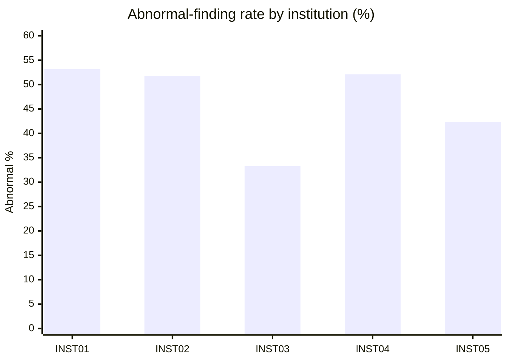
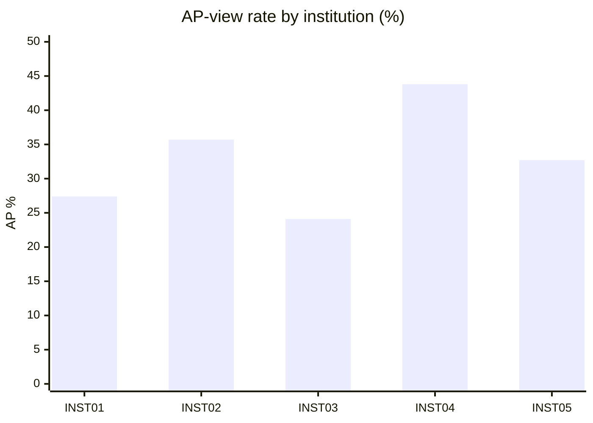

# Deep dive: CLEAR — an auditable foundation model for radiology grounded in clinical concepts

- Issue: #2
- Paper: [`recommended/2026-08-19/clear-auditable-foundation-model-radiology-concepts/paper.json`](../../recommended/2026-08-19/clear-auditable-foundation-model-radiology-concepts/paper.json)
- DOI: https://doi.org/10.1038/s41551-026-01741-4
- Approved plan: [`plan.md`](./plan.md)

## What the paper reports

CLEAR is a chest X-ray foundation model trained on **~0.87 million image-report pairs from
239,391 patients**, projecting images into a clinical-concept embedding space so every
prediction decomposes into weighted contributions from individual radiological findings.
It was externally validated on **four large, physician-annotated datasets from the US, Europe,
and Asia**, and the paper highlights three downstream uses: auditable zero-shot pathology
detection, systematic identification of radiological confounders, and expert-level concept
bottleneck models built from data-driven concepts.
(Source: paper abstract, `paper.json`.)

## What our data shows

We hold no CLEAR model weights or predictions — we cannot reproduce its classification
performance. What we *can* do, following the approved plan, is apply the paper's own
"audit for confounders across institutions" lens directly to our masked cohort's finding
labels and view positions.

### Cohort summary

Query:
```sql
SELECT count(*) as total_records, count(distinct patient_key) as unique_patients,
       round(avg(age),1) as mean_age, min(age), max(age)
FROM llm.hospital;
```
Result: **272 records, 153 unique patients, mean age 51.5 (range 9–87)**.

```sql
SELECT sex, count(*) FROM llm.hospital GROUP BY sex;
```
Result: **F 136 / M 136**.

```sql
SELECT department, count(*) FROM llm.hospital GROUP BY department ORDER BY count(*) DESC;
```
Result: radiology 57, internal_medicine 57, cardiology 53, emergency 53, pulmonology 52.

### Finding-label distribution by institution

Query:
```sql
SELECT institution_code, count(*) as total,
       count(*) FILTER (WHERE findings_label = 'No Finding') as no_finding,
       count(*) FILTER (WHERE findings_label <> 'No Finding') as abnormal
FROM llm.hospital GROUP BY institution_code ORDER BY institution_code;
```

<details>
<summary>Full result</summary>

| Institution | Total | No Finding | Abnormal | Abnormal % |
|---|---|---|---|---|
| INST01 | 62 | 29 | 33 | 53.2% |
| INST02 | 56 | 27 | 29 | 51.8% |
| INST03 | 54 | 36 | 18 | 33.3% |
| INST04 | 48 | 23 | 25 | 52.1% |
| INST05 | 52 | 30 | 22 | 42.3% |

</details>



See [`figure.svg`](./figure.svg) for the stacked No Finding vs. Abnormal bar chart (the
dashboard's primary visual, matching the plan's item 1).

### View position (PA/AP) by institution

Query:
```sql
SELECT institution_code, view_position, count(*)
FROM llm.hospital GROUP BY institution_code, view_position
ORDER BY institution_code, view_position;
```

<details>
<summary>Full result</summary>

| Institution | AP | PA | AP % |
|---|---|---|---|
| INST01 | 17 | 45 | 27.4% |
| INST02 | 20 | 36 | 35.7% |
| INST03 | 13 | 41 | 24.1% |
| INST04 | 21 | 27 | 43.8% |
| INST05 | 17 | 35 | 32.7% |

</details>



## What we infer

The paper's central methodological claim relevant to us is that concept-level models let you
*audit* whether apparent site-to-site differences in predicted labels are really driven by
confounders like projection mix (AP vs. PA) rather than true prevalence. Our cohort shows the
raw ingredients for exactly that kind of audit: abnormal-finding rate ranges from 33.3%
(INST03) to 53.2% (INST01), and AP-view rate ranges from 24.1% (INST03) to 43.8% (INST04) —
notably, INST03 has both the lowest abnormal rate *and* the lowest AP rate, and INST04 has a
high abnormal rate alongside the highest AP rate, consistent with the paper's premise that
projection mix can co-vary with apparent finding prevalence.

This is **hypothesis-generating only**: with 48–62 records per institution, these percentage
differences could plausibly arise from sampling noise alone, and we did not run a significance
test (chi-square or similar) as part of this deep dive scope. We also have no CLEAR model
output to confirm whether an actual concept-embedding classifier would misattribute the
confounder the way it does in the paper's external cohorts.

## Deviations from the approved plan

- The plan's item 3 (cohort summary table) and item 1 (finding-label stacked bar) are
  delivered as specified. Item 2 (view-position grouped bar) is delivered as a mermaid chart
  in this README and as raw numbers in `analysis.json`, but only the stacked bar in item 1 was
  rendered as the dashboard `figure.svg`, per the "figure stays the one that reaches the
  dashboard" constraint — we did not produce a second SVG for view position to avoid
  ambiguity about which single chart the dashboard should inline.
- No significance testing (e.g., chi-square across institutions) was added, since it was not
  named in the approved plan; this is called out as a possible follow-up in the PR, not
  performed here.

## Limitations

- Sample size: 272 records across 5 institutions (48–62 each) is far smaller than CLEAR's
  training (~0.87M pairs) or external validation cohorts, so no claim here validates CLEAR's
  actual model performance.
- No model artifact: we hold no CLEAR weights, embeddings, or predictions, so "auditability"
  claims in the paper (zero-shot detection, concept bottleneck models) are untested by this
  deep dive — we only replicate the *descriptive* confounder-audit framing.
- Institution semantics unconfirmed: whether `INST01`–`INST05` represent genuinely distinct
  clinical sites (with different equipment/populations) or an internal partition of one
  dataset is not verified here and should be confirmed by the physician before any merge.
- Observed percentage differences are not statistically tested and may reflect small-sample
  variability rather than a real site effect.
